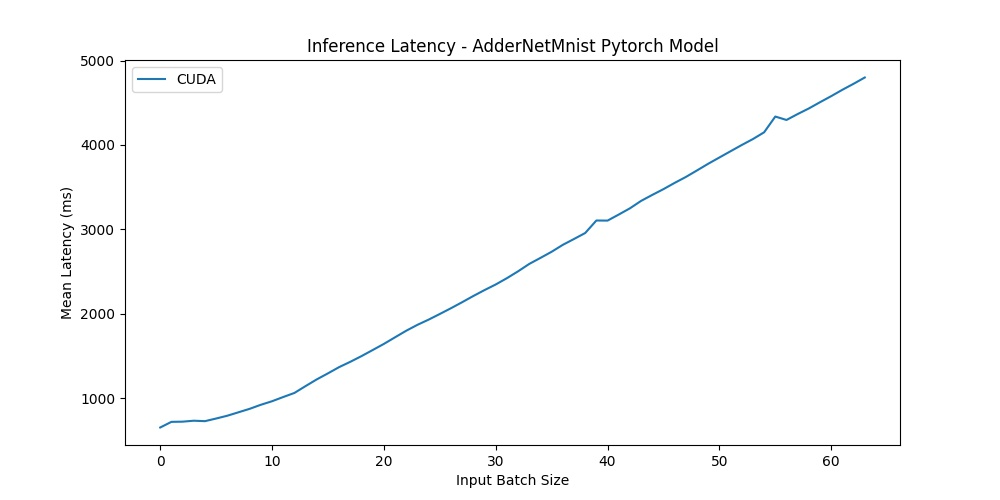
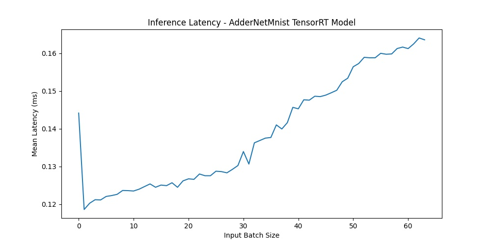

# AdderNet Model Conversion to TensorRT

<p align="center">
    
</p>

<p align="center">
    
</p>


## Requirements
- cuda 10.2
- cudnn 8.0
- TensorRT 7.1
- python 3.6
- pytorch = 1.6.0


# AdderNetTensorRT
This project implements the Adder Layer mentioned in https://arxiv.org/pdf/1912.13200.pdf using TensorRT custom layer Plugin API.
Original pytorch implementation of the AdderNet is found in  https://github.com/huawei-noah/AdderNet/. That is not CUDA or TensoRT capable.

Execute the following scripts for latency and accuracy calculation.
```bash
python addernet_mnist.py --> for pytorch results
python addernet_mnist_trt.py --> for tensorrt results
```

Execute the following scripts for unit test the adder layer. 
Output feature values should be the same from both scripts.
```bash
cd test
python test_adder_layer.py --> for pytorch results
python test_adder_layer_trt.py --> for tensorrt results
```

Any other neural network architectures containing Adder Layers can be implemented in TensorRT using this Adder Layer Plugin.

addenet_mnist_v1.py is implemented without BatchNormalization layers. If you train this model you'll see the model is not training well.
addenet_mnist_v2.py is also implemented without BatchNormalization layers but tanh activation is used instead of relu to get use of the negative values outputs from Adder layers.
Still the model is not training well.
  
# System Requirements
- python 3.6, numpy, matplotlib
- gcc 7.5.0   
- cuda 10.2
- cudnn 8.0
- TensorRT 7.1
- PyTorch>=1.5

# Installation
Make sure you have installed the dependency list above.
```bash
cd AdderNet_TensorRT/plugin
mkdir build
cd build
cmake ..
make
```
Following files will be created in the build directory.
- libadder2dtrt.so shared library for cpp unit test cases in the build folder.
- adder2dpytrt.so pybind library to be used when import Adder2dPlugin using python modules.
- Two Unit testing executables named 'TestAdder2dPlugin' and 'TestAdderFilterCudaKernel'. 

